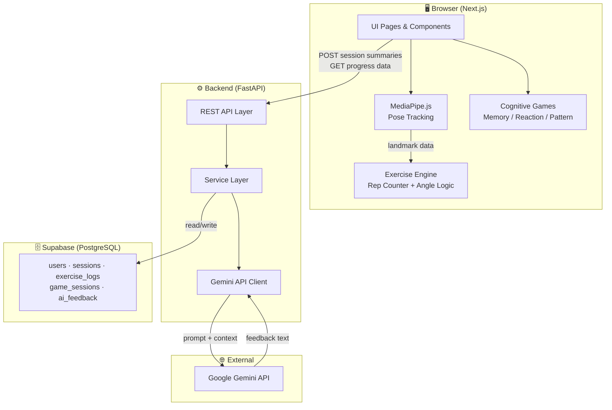
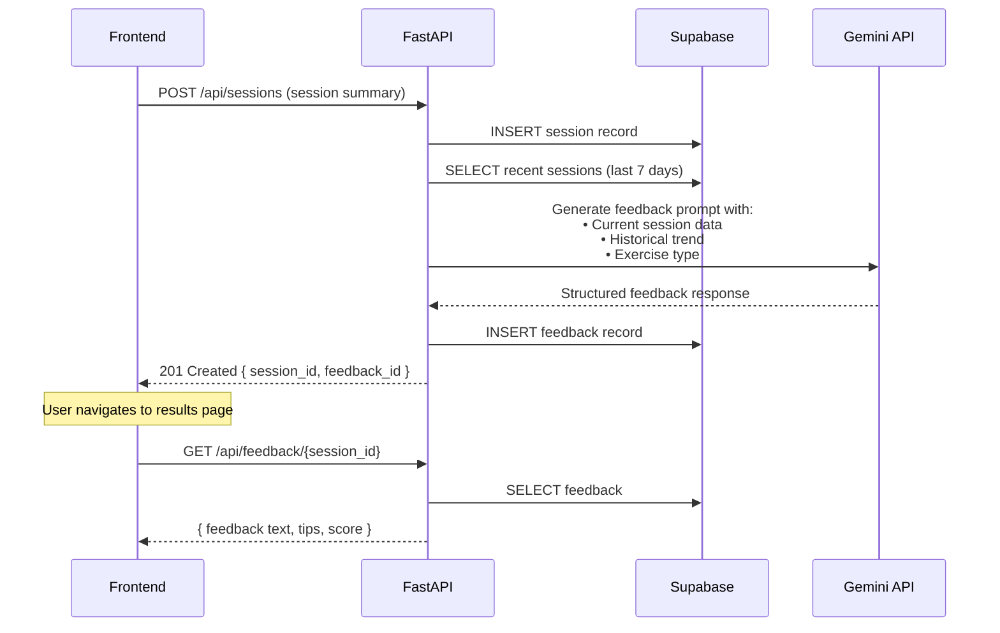
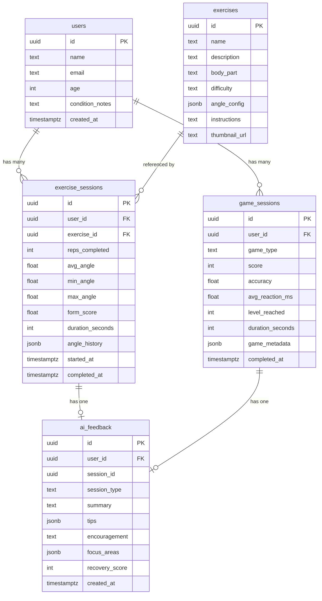

# 🏗️ AI Rehabilitation System — Architecture Plan

> **Hackathon Mode** · 18-hour build · 2–3 developers · Web only  
> **Stack**: Next.js · FastAPI · Supabase · Gemini API · MediaPipe.js

---

## Table of Contents

1. [Architecture Overview](#1--architecture-overview)
2. [Frontend Architecture](#2--frontend-architecture)
3. [Backend Architecture](#3--backend-architecture)
4. [Data Model](#4--data-model)
5. [API Contract](#5--api-contract)
6. [Folder Structure](#6--folder-structure)
7. [Parallel Development Plan](#7--parallel-development-plan)
8. [Execution Order](#8--what-to-build-first)
9. [What to Skip for V1](#9--what-to-skip-for-v1)
10. [Risks / Open Questions](#10--risks--open-questions)

---

## 1 — Architecture Overview

### Plain English System Flow

1. **User opens the web app** → lands on the Dashboard showing recovery progress.
2. **User starts a physio exercise** → the webcam activates, MediaPipe tracks their skeleton **entirely in the browser** (no video ever leaves the device).
3. **The frontend exercise engine** counts reps, measures joint angles, and tracks form quality — all client-side using MediaPipe landmarks.
4. **When a session ends**, the frontend sends a **summary** (rep count, angle stats, duration, form score) to FastAPI.
5. **FastAPI stores the session** in Supabase, then calls **Gemini API** with the session data + historical progress to generate personalized recovery feedback.
6. **Cognitive games** (memory, reaction, pattern) run entirely in the browser. On completion, the score/metrics are sent to FastAPI and stored.
7. **The Dashboard** pulls aggregated progress data from FastAPI to render charts and recovery insights.

### System Diagram



### Key Design Decisions

| Decision | Rationale |
|---|---|
| **MediaPipe runs in browser** | Zero latency, no video upload, works offline for tracking |
| **Exercise logic is client-side** | Angle math + rep counting needs real-time (60fps) — backend round-trip too slow |
| **Backend is a thin API** | Stores results, orchestrates Gemini calls, serves aggregated data |
| **Single Supabase DB** | No need for caches, queues, or multiple stores in 18 hours |
| **No WebSocket** | REST is sufficient — we send summaries, not frame-by-frame data |
| **No auth for V1** | Use a simple user-select dropdown or session ID; skip OAuth/JWT |

---

## 2 — Frontend Architecture

### Pages / Routes (Next.js App Router)

```
/                       → Landing / Home (redirect to dashboard)
/dashboard              → Progress Dashboard (charts, insights, recent sessions)
/exercises              → Exercise Library (list of available exercises)
/exercises/[id]/start   → Live Exercise Session (webcam + tracking + rep counter)
/exercises/[id]/results → Session Results (summary + AI feedback)
/games                  → Cognitive Games Hub (pick a game)
/games/memory           → Memory Card Game
/games/reaction         → Reaction Time Game
/games/pattern          → Pattern Matching Game
/games/[type]/results   → Game Results (score + AI feedback)
/profile                → User Profile / Session History
```

### Components Breakdown

```
components/
├── layout/
│   ├── Navbar.tsx              → Top nav with links to Dashboard, Exercises, Games
│   ├── Sidebar.tsx             → Optional sidebar for desktop
│   └── PageWrapper.tsx         → Shared layout wrapper
│
├── dashboard/
│   ├── ProgressChart.tsx       → Line/bar chart for recovery over time
│   ├── RecentSessions.tsx      → List of last 5–10 sessions
│   ├── InsightCard.tsx         → AI-generated insight display card
│   └── StatCard.tsx            → Single metric card (total reps, streak, etc.)
│
├── exercises/
│   ├── ExerciseCard.tsx        → Card in exercise library
│   ├── PoseCanvas.tsx          → Canvas overlay for MediaPipe skeleton rendering
│   ├── WebcamFeed.tsx          → Webcam video element + MediaPipe initialization
│   ├── RepCounter.tsx          → Live rep count + angle display
│   ├── FormIndicator.tsx       → Real-time form quality indicator (good/bad)
│   └── SessionSummary.tsx      → Post-session summary display
│
├── games/
│   ├── GameCard.tsx            → Card in games hub
│   ├── MemoryGame.tsx          → Memory card flip game
│   ├── ReactionGame.tsx        → Reaction time test
│   ├── PatternGame.tsx         → Pattern sequence game
│   └── GameResult.tsx          → Score display + metrics
│
├── feedback/
│   ├── AIFeedbackCard.tsx      → Displays Gemini-generated feedback
│   └── FeedbackLoader.tsx      → Loading state while Gemini processes
│
└── shared/
    ├── Button.tsx
    ├── Card.tsx
    ├── Modal.tsx
    ├── LoadingSpinner.tsx
    └── EmptyState.tsx
```

### State Management Approach

| What | How | Why |
|---|---|---|
| **Pose landmarks** (60fps) | `useRef` + local state in `PoseCanvas` | Too fast for React re-renders; write to canvas via ref |
| **Exercise session data** | `useState` in exercise page | Scoped to single session, no need for global |
| **Game state** | `useState` / `useReducer` in game component | Self-contained per game |
| **Dashboard data** | `fetch` in `useEffect` (or SWR/React Query) | Server data, cache briefly |
| **User context** | React Context (`UserContext`) | Light user info shared across pages |

> **No Redux, no Zustand.** The app has no complex cross-page state. Keep it simple.

### Where MediaPipe Runs

- **Location**: Inside `WebcamFeed.tsx` component, loaded as a client-side module (`"use client"`)
- **How**: Import `@mediapipe/tasks-vision` → create `PoseLandmarker` → feed webcam frames → output 33 landmarks per frame
- **Data flow**: Landmarks → `PoseCanvas.tsx` (draws skeleton) + `ExerciseEngine` (utility function that computes angles/reps)
- **Exercise engine** is a **plain TypeScript utility** (`lib/exerciseEngine.ts`), NOT a component — it takes landmarks + exercise config, returns rep count, current angle, form quality

### How Frontend Talks to Backend

- **HTTP client**: Native `fetch` (or a thin wrapper in `lib/api.ts`)
- **Base URL**: `NEXT_PUBLIC_API_URL` env var → `http://localhost:8000` in dev
- **Pattern**: All API calls go through `lib/api.ts` helper functions
- **When**:
  - On exercise session end → `POST /api/sessions`
  - On game completion → `POST /api/game-sessions`
  - On dashboard load → `GET /api/progress/{user_id}`
  - On results page → `GET /api/feedback/{session_id}`

---

## 3 — Backend Architecture

### FastAPI Structure

```
┌─────────────────────────────────────┐
│           FastAPI App               │
├─────────────────────────────────────┤
│  Routers (API Layer)                │
│  ├── sessions.py                    │
│  ├── games.py                       │
│  ├── progress.py                    │
│  ├── feedback.py                    │
│  └── users.py                       │
├─────────────────────────────────────┤
│  Services (Business Logic)          │
│  ├── session_service.py             │
│  ├── game_service.py                │
│  ├── progress_service.py            │
│  ├── feedback_service.py            │
│  └── gemini_service.py              │
├─────────────────────────────────────┤
│  Models (Pydantic Schemas)          │
│  ├── session_models.py              │
│  ├── game_models.py                 │
│  ├── progress_models.py             │
│  ├── feedback_models.py             │
│  └── user_models.py                 │
├─────────────────────────────────────┤
│  Database (Supabase Client)         │
│  └── supabase_client.py             │
├─────────────────────────────────────┤
│  Config                             │
│  └── settings.py                    │
└─────────────────────────────────────┘
```

### Module Responsibilities

| Module | Responsibility |
|---|---|
| **sessions** | CRUD for exercise sessions. Receives session summaries from frontend, stores in Supabase, triggers AI feedback generation |
| **games** | CRUD for cognitive game sessions. Stores game results, triggers AI feedback |
| **progress** | Aggregates data for dashboard. Computes streaks, totals, trends from session + game data |
| **feedback** | Manages AI feedback records. Retrieves stored feedback, triggers re-generation if needed |
| **users** | Minimal user management. Create user, get user profile, list users |
| **gemini_service** | Wraps Gemini API calls. Builds prompts from session data + history, parses responses |

### How Gemini API Is Used



**Gemini Prompt Strategy:**
- **System prompt**: "You are a physiotherapy AI assistant. Analyze the exercise session data and provide constructive, encouraging feedback for rehabilitation."
- **User prompt**: Includes exercise type, reps completed, average angle, form score, duration, and a summary of the last 5 sessions for trend context.
- **Output format**: Ask Gemini for JSON with fields: `summary`, `tips` (array), `encouragement`, `focus_areas` (array), `recovery_score` (1–10).

### Where Business Logic Lives

| Logic | Location | Why |
|---|---|---|
| Angle calculation, rep counting | **Frontend** (`lib/exerciseEngine.ts`) | Needs real-time (60fps), can't have network latency |
| Form quality scoring | **Frontend** (`lib/exerciseEngine.ts`) | Derived from angles in real-time |
| Session aggregation | **Backend** (`progress_service.py`) | Queries DB, computes trends |
| AI prompt building | **Backend** (`gemini_service.py`) | Needs historical data from DB |
| Game scoring | **Frontend** (game components) | Immediate feedback needed |
| Recovery insights | **Backend** (`feedback_service.py`) | Combines multiple data sources |

---

## 4 — Data Model

### Entity Relationship Diagram



### Table Details

#### `users`
| Column | Type | Constraints | Notes |
|---|---|---|---|
| `id` | `uuid` | PK, default `gen_random_uuid()` | |
| `name` | `text` | NOT NULL | Display name |
| `email` | `text` | UNIQUE, nullable | Optional for V1 |
| `age` | `int` | nullable | For age-adjusted feedback |
| `condition_notes` | `text` | nullable | E.g. "left knee ACL recovery" |
| `created_at` | `timestamptz` | default `now()` | |

#### `exercises` (Seed data — pre-populated)
| Column | Type | Constraints | Notes |
|---|---|---|---|
| `id` | `uuid` | PK | |
| `name` | `text` | NOT NULL | E.g. "Shoulder Flexion" |
| `description` | `text` | | Short description |
| `body_part` | `text` | NOT NULL | `"shoulder"`, `"knee"`, `"elbow"`, `"hip"` |
| `difficulty` | `text` | default `'beginner'` | `"beginner"`, `"intermediate"`, `"advanced"` |
| `angle_config` | `jsonb` | NOT NULL | `{ "joint": "left_shoulder", "points": ["left_elbow", "left_shoulder", "left_hip"], "target_angle": 160, "threshold": 15 }` |
| `instructions` | `text` | | Step-by-step text |
| `thumbnail_url` | `text` | nullable | Static image URL |

#### `exercise_sessions`
| Column | Type | Constraints | Notes |
|---|---|---|---|
| `id` | `uuid` | PK | |
| `user_id` | `uuid` | FK → users.id, NOT NULL | |
| `exercise_id` | `uuid` | FK → exercises.id, NOT NULL | |
| `reps_completed` | `int` | NOT NULL | |
| `avg_angle` | `float` | | Average peak angle across reps |
| `min_angle` | `float` | | Min angle reached |
| `max_angle` | `float` | | Max angle reached |
| `form_score` | `float` | | 0.0 – 1.0 scale |
| `duration_seconds` | `int` | | Total session time |
| `angle_history` | `jsonb` | nullable | Array of angle values per rep: `[{ "rep": 1, "peak_angle": 155 }, ...]` |
| `started_at` | `timestamptz` | NOT NULL | |
| `completed_at` | `timestamptz` | NOT NULL | |

#### `game_sessions`
| Column | Type | Constraints | Notes |
|---|---|---|---|
| `id` | `uuid` | PK | |
| `user_id` | `uuid` | FK → users.id, NOT NULL | |
| `game_type` | `text` | NOT NULL | `"memory"`, `"reaction"`, `"pattern"` |
| `score` | `int` | NOT NULL | Final score |
| `accuracy` | `float` | nullable | 0.0 – 1.0 |
| `avg_reaction_ms` | `float` | nullable | For reaction game |
| `level_reached` | `int` | nullable | For pattern game |
| `duration_seconds` | `int` | | |
| `game_metadata` | `jsonb` | nullable | Any extra game-specific data |
| `completed_at` | `timestamptz` | default `now()` | |

#### `ai_feedback`
| Column | Type | Constraints | Notes |
|---|---|---|---|
| `id` | `uuid` | PK | |
| `user_id` | `uuid` | FK → users.id, NOT NULL | |
| `session_id` | `uuid` | NOT NULL | Points to either `exercise_sessions.id` or `game_sessions.id` |
| `session_type` | `text` | NOT NULL | `"exercise"` or `"game"` |
| `summary` | `text` | | Gemini-generated summary |
| `tips` | `jsonb` | | Array of strings |
| `encouragement` | `text` | | Motivational message |
| `focus_areas` | `jsonb` | | Array of strings |
| `recovery_score` | `int` | | 1–10 scale |
| `created_at` | `timestamptz` | default `now()` | |

---

## 5 — API Contract

> [!IMPORTANT]
> These contracts are **locked**. Frontend and backend developers must implement to this exact spec. Any changes require both parties to agree.

**Base URL**: `http://localhost:8000/api`  
**Content-Type**: `application/json`  
**ID format**: UUID v4 strings

---

### 5.1 Users

#### `POST /api/users` — Create User

**Request Body:**
```json
{
  "name": "Athar Khan",
  "email": "athar@example.com",
  "age": 28,
  "condition_notes": "Right knee ACL recovery, 3 weeks post-op"
}
```

**Response** `201 Created`:
```json
{
  "id": "a1b2c3d4-...",
  "name": "Athar Khan",
  "email": "athar@example.com",
  "age": 28,
  "condition_notes": "Right knee ACL recovery, 3 weeks post-op",
  "created_at": "2026-04-04T05:30:00Z"
}
```

---

#### `GET /api/users` — List All Users

**Response** `200 OK`:
```json
[
  {
    "id": "a1b2c3d4-...",
    "name": "Athar Khan",
    "created_at": "2026-04-04T05:30:00Z"
  }
]
```

---

#### `GET /api/users/{user_id}` — Get User Profile

**Response** `200 OK`:
```json
{
  "id": "a1b2c3d4-...",
  "name": "Athar Khan",
  "email": "athar@example.com",
  "age": 28,
  "condition_notes": "Right knee ACL recovery, 3 weeks post-op",
  "created_at": "2026-04-04T05:30:00Z"
}
```

---

### 5.2 Exercises (Catalog)

#### `GET /api/exercises` — List All Exercises

**Query Params** (optional):
- `body_part` — filter by body part (`shoulder`, `knee`, `elbow`, `hip`)
- `difficulty` — filter by difficulty (`beginner`, `intermediate`, `advanced`)

**Response** `200 OK`:
```json
[
  {
    "id": "e1f2a3b4-...",
    "name": "Shoulder Flexion",
    "description": "Raise your arm forward and upward",
    "body_part": "shoulder",
    "difficulty": "beginner",
    "angle_config": {
      "joint": "left_shoulder",
      "points": ["left_elbow", "left_shoulder", "left_hip"],
      "target_angle": 160,
      "threshold": 15
    },
    "instructions": "Stand with arms at your side. Slowly raise your arm forward...",
    "thumbnail_url": "/images/shoulder-flexion.png"
  }
]
```

---

#### `GET /api/exercises/{exercise_id}` — Get Single Exercise

**Response** `200 OK`: Same shape as single item from list above.

---

### 5.3 Exercise Sessions

#### `POST /api/sessions` — Save Exercise Session

**Request Body:**
```json
{
  "user_id": "a1b2c3d4-...",
  "exercise_id": "e1f2a3b4-...",
  "reps_completed": 12,
  "avg_angle": 148.5,
  "min_angle": 45.0,
  "max_angle": 162.3,
  "form_score": 0.85,
  "duration_seconds": 180,
  "angle_history": [
    { "rep": 1, "peak_angle": 155.2 },
    { "rep": 2, "peak_angle": 150.1 },
    { "rep": 3, "peak_angle": 148.7 }
  ],
  "started_at": "2026-04-04T05:30:00Z",
  "completed_at": "2026-04-04T05:33:00Z"
}
```

**Response** `201 Created`:
```json
{
  "id": "s1e2s3s4-...",
  "user_id": "a1b2c3d4-...",
  "exercise_id": "e1f2a3b4-...",
  "reps_completed": 12,
  "avg_angle": 148.5,
  "min_angle": 45.0,
  "max_angle": 162.3,
  "form_score": 0.85,
  "duration_seconds": 180,
  "started_at": "2026-04-04T05:30:00Z",
  "completed_at": "2026-04-04T05:33:00Z",
  "feedback_id": "f1e2e3d4-..."
}
```

> [!NOTE]
> `feedback_id` is returned because the backend automatically triggers Gemini feedback generation on session creation. Frontend uses this ID to poll/fetch feedback.

---

#### `GET /api/sessions/{session_id}` — Get Session Details

**Response** `200 OK`:
```json
{
  "id": "s1e2s3s4-...",
  "user_id": "a1b2c3d4-...",
  "exercise_id": "e1f2a3b4-...",
  "exercise_name": "Shoulder Flexion",
  "reps_completed": 12,
  "avg_angle": 148.5,
  "min_angle": 45.0,
  "max_angle": 162.3,
  "form_score": 0.85,
  "duration_seconds": 180,
  "angle_history": [...],
  "started_at": "2026-04-04T05:30:00Z",
  "completed_at": "2026-04-04T05:33:00Z"
}
```

---

#### `GET /api/sessions?user_id={user_id}` — List User Sessions

**Query Params:**
- `user_id` (required) — UUID
- `limit` (optional, default `20`) — max results
- `offset` (optional, default `0`) — pagination

**Response** `200 OK`:
```json
{
  "sessions": [
    {
      "id": "s1e2s3s4-...",
      "exercise_name": "Shoulder Flexion",
      "reps_completed": 12,
      "form_score": 0.85,
      "duration_seconds": 180,
      "completed_at": "2026-04-04T05:33:00Z"
    }
  ],
  "total": 45
}
```

---

### 5.4 Game Sessions

#### `POST /api/game-sessions` — Save Game Session

**Request Body:**
```json
{
  "user_id": "a1b2c3d4-...",
  "game_type": "memory",
  "score": 850,
  "accuracy": 0.92,
  "avg_reaction_ms": null,
  "level_reached": 5,
  "duration_seconds": 120,
  "game_metadata": {
    "pairs_matched": 12,
    "total_pairs": 15,
    "mismatches": 3
  }
}
```

**Response** `201 Created`:
```json
{
  "id": "g1a2m3e4-...",
  "user_id": "a1b2c3d4-...",
  "game_type": "memory",
  "score": 850,
  "accuracy": 0.92,
  "level_reached": 5,
  "duration_seconds": 120,
  "completed_at": "2026-04-04T06:00:00Z",
  "feedback_id": "f2e3e4d5-..."
}
```

---

#### `GET /api/game-sessions?user_id={user_id}` — List Game Sessions

**Query Params:**
- `user_id` (required)
- `game_type` (optional) — `memory`, `reaction`, `pattern`
- `limit` (optional, default `20`)

**Response** `200 OK`:
```json
{
  "sessions": [
    {
      "id": "g1a2m3e4-...",
      "game_type": "memory",
      "score": 850,
      "accuracy": 0.92,
      "duration_seconds": 120,
      "completed_at": "2026-04-04T06:00:00Z"
    }
  ],
  "total": 18
}
```

---

### 5.5 AI Feedback

#### `GET /api/feedback/{session_id}?session_type={type}` — Get Feedback for a Session

**Query Params:**
- `session_type` (required) — `"exercise"` or `"game"`

**Response** `200 OK`:
```json
{
  "id": "f1e2e3d4-...",
  "session_id": "s1e2s3s4-...",
  "session_type": "exercise",
  "summary": "Great session! Your shoulder flexion range improved by 5° compared to your last session. You maintained consistent form throughout.",
  "tips": [
    "Try to hold the peak position for 2 seconds before lowering",
    "Focus on keeping your elbow straight during the raise",
    "Consider increasing reps to 15 next session"
  ],
  "encouragement": "You're making excellent progress! Your consistency is paying off — keep up the great work! 💪",
  "focus_areas": [
    "End-range hold time",
    "Elbow extension consistency"
  ],
  "recovery_score": 7,
  "created_at": "2026-04-04T05:33:05Z"
}
```

**Response** `202 Accepted` (if feedback is still generating):
```json
{
  "status": "processing",
  "message": "AI feedback is being generated. Please retry in a few seconds."
}
```

---

### 5.6 Progress / Dashboard

#### `GET /api/progress/{user_id}` — Get Dashboard Data

**Response** `200 OK`:
```json
{
  "user_id": "a1b2c3d4-...",
  "summary": {
    "total_exercise_sessions": 45,
    "total_game_sessions": 18,
    "total_reps": 540,
    "avg_form_score": 0.82,
    "current_streak_days": 5,
    "total_active_days": 12
  },
  "exercise_progress": [
    {
      "date": "2026-04-01",
      "sessions": 2,
      "total_reps": 24,
      "avg_form_score": 0.80
    },
    {
      "date": "2026-04-02",
      "sessions": 1,
      "total_reps": 15,
      "avg_form_score": 0.85
    }
  ],
  "game_progress": [
    {
      "date": "2026-04-01",
      "game_type": "memory",
      "best_score": 850,
      "avg_accuracy": 0.88
    }
  ],
  "recent_feedback": [
    {
      "id": "f1e2e3d4-...",
      "session_type": "exercise",
      "summary": "Great shoulder flexion session...",
      "recovery_score": 7,
      "created_at": "2026-04-04T05:33:05Z"
    }
  ],
  "body_part_breakdown": [
    { "body_part": "shoulder", "sessions": 20, "avg_form_score": 0.84 },
    { "body_part": "knee", "sessions": 15, "avg_form_score": 0.79 }
  ]
}
```

---

#### `GET /api/progress/{user_id}/exercise-trend` — Exercise Trend (Charts)

**Query Params:**
- `days` (optional, default `30`) — how many days back
- `exercise_id` (optional) — filter by specific exercise

**Response** `200 OK`:
```json
{
  "trend": [
    {
      "date": "2026-04-01",
      "avg_angle": 145.2,
      "avg_form_score": 0.80,
      "total_reps": 24
    },
    {
      "date": "2026-04-02",
      "avg_angle": 148.5,
      "avg_form_score": 0.85,
      "total_reps": 15
    }
  ]
}
```

---

### 5.7 Error Responses (Standard)

All errors follow this shape:

```json
{
  "detail": "User not found",
  "status_code": 404
}
```

| Status Code | When |
|---|---|
| `400` | Bad request / validation error |
| `404` | Resource not found |
| `500` | Server error / Gemini API failure |

---

## 6 — Folder Structure

### 6.1 Frontend (Next.js — App Router)

```
frontend/
├── public/
│   └── images/
│       └── exercises/          # Exercise thumbnail images
│
├── src/
│   ├── app/
│   │   ├── layout.tsx          # Root layout (navbar, fonts, metadata)
│   │   ├── page.tsx            # Home → redirect to /dashboard
│   │   ├── globals.css         # Global styles + CSS variables
│   │   │
│   │   ├── dashboard/
│   │   │   └── page.tsx        # Dashboard page
│   │   │
│   │   ├── exercises/
│   │   │   ├── page.tsx        # Exercise library listing
│   │   │   └── [id]/
│   │   │       ├── start/
│   │   │       │   └── page.tsx  # Live exercise session
│   │   │       └── results/
│   │   │           └── page.tsx  # Session results + feedback
│   │   │
│   │   ├── games/
│   │   │   ├── page.tsx        # Games hub
│   │   │   ├── memory/
│   │   │   │   └── page.tsx
│   │   │   ├── reaction/
│   │   │   │   └── page.tsx
│   │   │   ├── pattern/
│   │   │   │   └── page.tsx
│   │   │   └── [type]/
│   │   │       └── results/
│   │   │           └── page.tsx
│   │   │
│   │   └── profile/
│   │       └── page.tsx
│   │
│   ├── components/
│   │   ├── layout/
│   │   │   ├── Navbar.tsx
│   │   │   ├── Sidebar.tsx
│   │   │   └── PageWrapper.tsx
│   │   ├── dashboard/
│   │   │   ├── ProgressChart.tsx
│   │   │   ├── RecentSessions.tsx
│   │   │   ├── InsightCard.tsx
│   │   │   └── StatCard.tsx
│   │   ├── exercises/
│   │   │   ├── ExerciseCard.tsx
│   │   │   ├── PoseCanvas.tsx
│   │   │   ├── WebcamFeed.tsx
│   │   │   ├── RepCounter.tsx
│   │   │   ├── FormIndicator.tsx
│   │   │   └── SessionSummary.tsx
│   │   ├── games/
│   │   │   ├── GameCard.tsx
│   │   │   ├── MemoryGame.tsx
│   │   │   ├── ReactionGame.tsx
│   │   │   ├── PatternGame.tsx
│   │   │   └── GameResult.tsx
│   │   ├── feedback/
│   │   │   ├── AIFeedbackCard.tsx
│   │   │   └── FeedbackLoader.tsx
│   │   └── shared/
│   │       ├── Button.tsx
│   │       ├── Card.tsx
│   │       ├── Modal.tsx
│   │       ├── LoadingSpinner.tsx
│   │       └── EmptyState.tsx
│   │
│   ├── lib/
│   │   ├── api.ts              # API client (fetch wrapper)
│   │   ├── exerciseEngine.ts   # Angle calc, rep counting, form scoring
│   │   ├── mediapipe.ts        # MediaPipe setup + config
│   │   ├── exercises.ts        # Exercise definitions + angle configs
│   │   └── utils.ts            # Shared helpers (formatDate, etc.)
│   │
│   ├── context/
│   │   └── UserContext.tsx      # User context provider
│   │
│   └── types/
│       └── index.ts            # TypeScript interfaces (Session, Game, Feedback, etc.)
│
├── .env.local                  # NEXT_PUBLIC_API_URL=http://localhost:8000
├── next.config.js
├── package.json
└── tsconfig.json
```

### 6.2 Backend (FastAPI)

```
backend/
├── app/
│   ├── __init__.py
│   ├── main.py                 # FastAPI app creation, CORS, router mounting
│   │
│   ├── routers/
│   │   ├── __init__.py
│   │   ├── users.py            # /api/users
│   │   ├── exercises.py        # /api/exercises
│   │   ├── sessions.py         # /api/sessions
│   │   ├── games.py            # /api/game-sessions
│   │   ├── progress.py         # /api/progress
│   │   └── feedback.py         # /api/feedback
│   │
│   ├── services/
│   │   ├── __init__.py
│   │   ├── user_service.py
│   │   ├── exercise_service.py
│   │   ├── session_service.py
│   │   ├── game_service.py
│   │   ├── progress_service.py
│   │   ├── feedback_service.py
│   │   └── gemini_service.py   # Gemini API integration
│   │
│   ├── models/
│   │   ├── __init__.py
│   │   ├── user_models.py      # Pydantic request/response models
│   │   ├── session_models.py
│   │   ├── game_models.py
│   │   ├── progress_models.py
│   │   └── feedback_models.py
│   │
│   ├── db/
│   │   ├── __init__.py
│   │   └── supabase_client.py  # Supabase client init
│   │
│   └── config/
│       ├── __init__.py
│       └── settings.py         # Env vars: SUPABASE_URL, SUPABASE_KEY, GEMINI_API_KEY
│
├── seed/
│   └── exercises.json          # Seed data for exercises table
│
├── .env                        # Environment variables
├── requirements.txt            # fastapi, uvicorn, supabase, google-generativeai
└── README.md
```

---

## 7 — Parallel Development Plan

### Team Roles

| Role | Person | Primary Scope |
|---|---|---|
| **Dev A** — Frontend Lead | — | Next.js UI, MediaPipe integration, exercise engine, games |
| **Dev B** — Backend Lead | — | FastAPI APIs, Supabase integration, Gemini integration |
| **Dev C** — Floater / Integration | — | Dashboard charts, styling polish, testing integration, seed data |

### Phase Plan

```mermaid
gantt
    title 18-Hour Hackathon Timeline
    dateFormat HH:mm
    axisFormat %H:%M

    section Phase 1 (Hours 0–3)
    Setup & Scaffold           :p1a, 00:00, 1h
    Seed Data + DB Schema      :p1b, 00:00, 1h
    Exercise Engine (FE lib)   :p1c, 01:00, 2h
    Users + Exercises API      :p1d, 01:00, 2h

    section Phase 2 (Hours 3–8)
    MediaPipe + PoseCanvas     :p2a, 03:00, 3h
    Sessions + Games API       :p2b, 03:00, 3h
    Cognitive Games (3 games)  :p2c, 06:00, 3h
    Gemini Integration         :p2d, 06:00, 2h

    section Phase 3 (Hours 8–13)
    Exercise Session Page      :p3a, 08:00, 3h
    Progress + Feedback API    :p3b, 08:00, 2h
    Dashboard Page + Charts    :p3c, 10:00, 3h

    section Phase 4 (Hours 13–18)
    Integration Testing        :p4a, 13:00, 2h
    UI Polish + Animations     :p4b, 13:00, 3h
    Bug Fixes + Demo Prep      :p4c, 15:00, 3h
```



### Detailed Task Breakdown

#### Phase 1: Scaffold & Foundation (Hours 0–3)

| Dev | Task | Duration | Output |
|---|---|---|---|
| **A** | Init Next.js, set up folder structure, install MediaPipe, set up layout + navbar | 1h | Runnable frontend shell |
| **B** | Init FastAPI, set up folder structure, configure Supabase client, create DB tables | 1h | Runnable backend shell + DB ready |
| **C** | Create `exercises.json` seed data (5–8 exercises with angle configs), write seed script | 1h | Populated exercises table |
| **A** | Build `exerciseEngine.ts` — angle calculation, rep counter, form scorer | 2h | Unit-testable utility |
| **B** | Build Users API + Exercises API (CRUD) | 2h | First working endpoints |
| **C** | Build shared TypeScript types (`types/index.ts`) from API contract | 1h | Type-safe frontend |

#### Phase 2: Core Features (Hours 3–8)

| Dev | Task | Duration | Output |
|---|---|---|---|
| **A** | Integrate MediaPipe in `WebcamFeed.tsx` + render skeleton on `PoseCanvas.tsx` | 3h | Working webcam + pose overlay |
| **B** | Build Sessions API + Game Sessions API (CRUD + validation) | 3h | All session endpoints working |
| **A** | Build 3 cognitive games (Memory, Reaction, Pattern) — keep simple! | 3h | 3 playable mini-games |
| **B** | Integrate Gemini API in `gemini_service.py` — prompt building + parsing | 2h | AI feedback generation working |
| **C** | Build `lib/api.ts` client + start on Exercise Library page | 3h | Frontend API layer ready |

#### Phase 3: Pages & Dashboard (Hours 8–13)

| Dev | Task | Duration | Output |
|---|---|---|---|
| **A** | Build live exercise session page (webcam + rep counter + form indicator) | 3h | Full exercise session flow |
| **B** | Build Progress API + Feedback API | 2h | Dashboard data endpoints ready |
| **B** | Help with integration, fix API issues | 1h | — |
| **C** | Build Dashboard page with charts (use Recharts or Chart.js) | 3h | Visual progress dashboard |
| **C** | Build results pages (exercise results + game results + AI feedback display) | 2h | Complete results flow |

#### Phase 4: Polish & Demo (Hours 13–18)

| Dev | Task | Duration | Output |
|---|---|---|---|
| **ALL** | Integration testing — run full flows end-to-end | 2h | All flows working |
| **A** | UI polish — animations, transitions, responsive tweaks | 3h | Polished frontend |
| **B** | Error handling, edge cases, fallback when Gemini is slow | 2h | Robust backend |
| **C** | Demo prep — seed realistic data, prepare demo script | 2h | Demo-ready |
| **ALL** | Final bug fixes + demo rehearsal | 1h | Ship it 🚀 |

### How to Avoid Blocking Each Other

| Potential Block | Solution |
|---|---|
| Backend not ready when frontend needs APIs | Frontend uses **mock data** (`lib/mockData.ts`) matching the API contract shapes. Switch to real API by changing `lib/api.ts` |
| API contract mismatch | Contract is **frozen above**. Both sides implement to it. Any change requires a 5-min sync |
| MediaPipe setup takes longer than expected | Games dev continues independently (no shared dependency) |
| Gemini API key issues | Backend returns **hardcoded fallback feedback** until API key works |
| Merge conflicts | Dev A owns `components/` + `app/`, Dev B owns `backend/`, Dev C bridges both — minimal overlap |

---

## 8 — What to Build First (Execution Order)

> [!TIP]
> Within each priority, tasks can be parallelized across devs.

### Priority 1 — Foundation (Must be done first)
1. Project scaffolding (both repos)
2. Supabase tables created
3. Exercise seed data populated
4. `exerciseEngine.ts` utility
5. Users + Exercises API endpoints
6. TypeScript types from API contract

### Priority 2 — Core Value (The "wow" for demo)
7. MediaPipe webcam + pose tracking
8. Live exercise session with rep counting
9. Sessions API + Game Sessions API
10. At least 1 cognitive game (Memory)

### Priority 3 — AI & Insights (The "AI" in the project name)
11. Gemini integration for exercise feedback
12. Feedback display on results pages
13. Dashboard with progress charts

### Priority 4 — Completeness
14. Remaining 2 cognitive games (Reaction, Pattern)
15. Game results + AI feedback for games
16. Profile page / session history
17. UI polish + animations

### Priority 5 — Nice to Have
18. Body-part breakdown chart
19. Streak tracking
20. Exercise difficulty progression suggestions

---

## 9 — What to Skip for V1

| Feature | Why Skip |
|---|---|
| **Authentication (OAuth/JWT)** | Use a simple user-select dropdown. No login screen. Saves 2+ hours |
| **Real-time collaboration** | No multi-user sessions needed for demo |
| **Video recording/playback** | Adds complexity for storage + privacy. Just track landmarks |
| **Mobile responsive design** | Web + desktop only. Skip media queries for phone |
| **Offline mode / PWA** | Nice to have, not needed for demo |
| **Admin panel** | No admin needed — just show user-facing app |
| **Exercise creation UI** | Use seed data. No need to create exercises from the app |
| **SSR / SEO optimization** | It's a webapp demo, not a public site |
| **Rate limiting / security hardening** | Demo environment only |
| **CI/CD pipeline** | Run locally, deploy if time permits |
| **Unit / integration tests** | Test manually. Ship over test in a hackathon |
| **Pose accuracy calibration** | Use MediaPipe defaults. Tune later |
| **Multi-language support** | English only |
| **Data export / PDF reports** | Dashboard visuals are sufficient for demo |

---

## 10 — Risks / Open Questions

### High Risks

| Risk | Impact | Mitigation |
|---|---|---|
| **MediaPipe model loading is slow** | Users wait 5–10s on first load | Show a loading screen with progress. Pre-load model on exercise library page |
| **Gemini API latency** | Users wait 3–5s for feedback | Return session results immediately, show feedback loading spinner, use `202 Accepted` pattern |
| **Webcam permission denied** | Exercise module unusable | Show clear error state with instructions. Games module still works independently |
| **Angle calculation accuracy** | Rep counting is unreliable | Use generous thresholds (±15°). Prioritize consistent counting over accuracy |
| **Supabase free tier limits** | DB goes down mid-demo | Monitor usage. Only store summary data, not raw frames |

### Medium Risks

| Risk | Impact | Mitigation |
|---|---|---|
| **CORS issues between Next.js and FastAPI** | API calls fail | Configure CORS in `main.py` on day 0 — allow `localhost:3000` |
| **Gemini API quota exceeded** | No AI feedback | Implement fallback hardcoded feedback in `gemini_service.py` |
| **MediaPipe not detecting all joints** | Angle calc fails for some exercises | Add null checks in `exerciseEngine.ts`, skip frames with missing landmarks |
| **Browser compatibility** | Webcam/MediaPipe fails on some browsers | Test on Chrome only. Add "Use Chrome" notice |

### Open Questions (Decide Before Coding)

| # | Question | Recommendation |
|---|---|---|
| 1 | **How many exercises to seed?** | 5–8 exercises covering 3–4 body parts. Enough for demo variety |
| 2 | **Which specific exercises?** | Shoulder Flexion, Shoulder Abduction, Elbow Flexion, Knee Extension, Hip Flexion, Standing Balance, Wrist Extension, Neck Rotation |
| 3 | **Should AI feedback be sync or async?** | **Async recommended.** POST session → return immediately with `feedback_id` → frontend polls GET `/feedback/{id}` until ready |
| 4 | **Which charting library?** | **Recharts** — lightweight, React-native, good defaults. Install: `npm i recharts` |
| 5 | **How to handle "user selection" without auth?** | A dropdown on the navbar that lets you pick a user from the users table. Store `selectedUserId` in React Context |
| 6 | **Deploy or local-only demo?** | Recommend **local demo** to save time. If deploying: Vercel (frontend) + Railway (backend) |
| 7 | **How many reps is a "good" session?** | Define in seed data per exercise. Default: 10 reps target |
| 8 | **MediaPipe model variant?** | Use `lite` model for faster loading. Switch to `full` only if accuracy is terrible |

---

> [!IMPORTANT]
> **Next steps after architecture approval:**
> 1. ✅ Confirm or adjust this architecture
> 2. 📋 I generate the Supabase SQL schema + seed data
> 3. 🐍 I generate the backend implementation plan (for Claude Code)
> 4. 🎨 I generate the frontend v0 builder prompt
>
> **Say "approved" or list your changes.**
