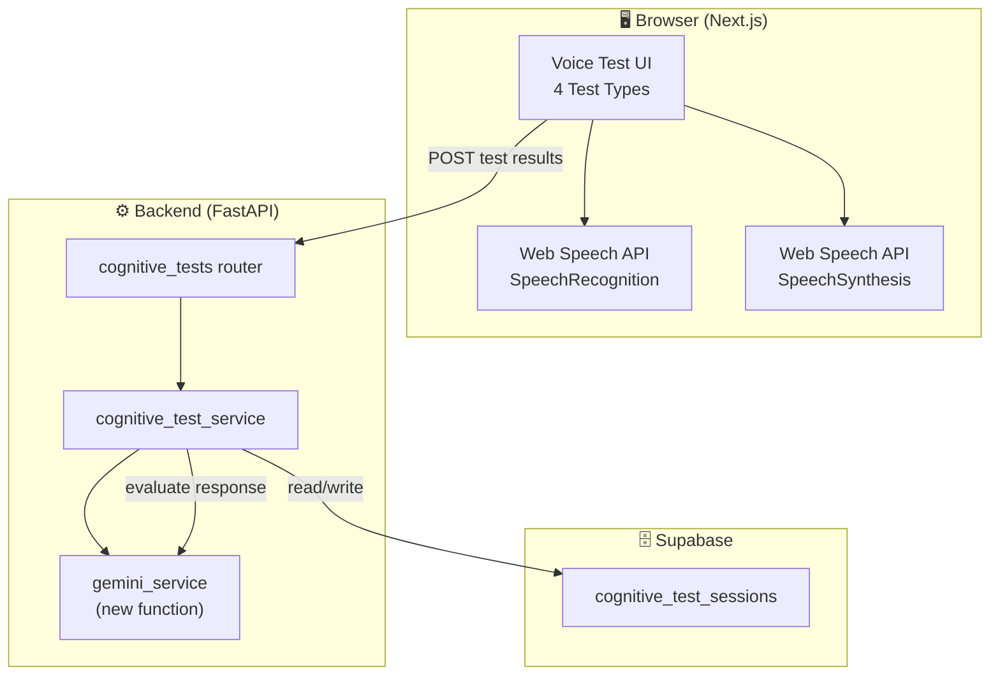

# Speech & Voice-Based Cognitive Testing Module

Add a complete voice-based cognitive assessment feature to the existing RehabAI app. This module evaluates memory, attention, language fluency, and reaction time through voice interaction — all without changing any existing logic.

## User Review Required

> [!IMPORTANT]
> **No new npm packages or Python packages needed.** We use the browser's built-in **Web Speech API** (`SpeechRecognition` + `SpeechSynthesis`) for STT/TTS. Cognitive evaluation (semantic similarity, scoring) is handled by **Gemini API** (already integrated). This keeps the stack lean and avoids heavy ML model downloads.

> [!WARNING]
> **Browser Compatibility:** Web Speech API is supported in Chrome, Edge, and Safari. Firefox has limited support (no `SpeechRecognition`). The UI will show a graceful fallback message on unsupported browsers.

> [!IMPORTANT]
> **New Supabase Table Required:** A `cognitive_test_sessions` table must be created in your Supabase SQL editor before using this feature. The SQL is provided below.

---

## Architecture Overview



**Key Design Decisions:**

| Decision | Rationale |
|---|---|
| **Web Speech API (browser-native)** | Zero dependencies, no model downloads, works offline for TTS, good accuracy for English |
| **Gemini evaluates responses** | Already integrated — perfect for semantic similarity, scoring, and generating feedback |
| **All timing done client-side** | Response time measurement needs millisecond precision — can't have network latency |
| **New DB table, not reusing `game_sessions`** | Cognitive tests have different metrics (transcript, response_time_ms, test_type subvariants) |
| **Follows existing patterns exactly** | Router → Service → Supabase pattern, Pydantic models, `api.ts` client functions |

---

## Proposed Changes

### Database Layer

#### [NEW] `cognitive_test_sessions` table (Supabase SQL)

```sql
CREATE TABLE cognitive_test_sessions (
  id uuid PRIMARY KEY DEFAULT gen_random_uuid(),
  user_id uuid NOT NULL REFERENCES users(id) ON DELETE CASCADE,
  test_type text NOT NULL,           -- 'memory_recall' | 'verbal_fluency' | 'attention_reaction' | 'sentence_repetition'
  score int NOT NULL,                -- 0-100
  response_time_ms int,              -- time from prompt end to speech start
  accuracy float,                    -- 0.0-1.0
  transcript text,                   -- what the user actually said (STT output)
  expected_response text,            -- what the correct answer was
  word_count int,                    -- number of valid words (for verbal fluency)
  error_count int,                   -- number of errors
  duration_seconds int,              -- total test duration
  test_metadata jsonb,               -- flexible: { difficulty, words_list, missed_words, etc. }
  completed_at timestamptz DEFAULT now()
);

CREATE INDEX idx_cognitive_test_sessions_user ON cognitive_test_sessions(user_id);
CREATE INDEX idx_cognitive_test_sessions_completed_at ON cognitive_test_sessions(completed_at DESC);
CREATE INDEX idx_cognitive_test_sessions_type ON cognitive_test_sessions(user_id, test_type);
```

---

### Backend — New Files (following existing patterns)

#### [NEW] [cognitive_test_models.py](file:///d:/nakhshatra/exercise/nakshatra_healthcare/backend/app/models/cognitive_test_models.py)

Pydantic models for request/response:
- `CognitiveTestCreate` — payload from frontend (user_id, test_type, score, transcript, expected_response, response_time_ms, accuracy, word_count, error_count, duration_seconds, test_metadata)
- `CognitiveTestCreateResponse` — returned after save (id, feedback_id, completed_at, etc.)
- `CognitiveTestListItem` — for listing past sessions
- `CognitiveTestListResponse` — { sessions, total }
- `CognitiveTestEvaluateRequest` — for asking Gemini to evaluate a response
- `CognitiveTestEvaluateResponse` — Gemini's evaluation (score, feedback, corrections)

#### [NEW] [cognitive_tests.py](file:///d:/nakhshatra/exercise/nakshatra_healthcare/backend/app/routers/cognitive_tests.py)

FastAPI router at `/api/cognitive-tests`:
- `POST /` — Save a completed cognitive test session, trigger Gemini feedback, store in DB
- `GET /` — List cognitive test sessions for a user (with `user_id`, optional `test_type`, `limit` query params)
- `POST /evaluate` — Send user transcript + expected answer to Gemini for real-time evaluation (used for immediate feedback before saving)

#### [NEW] [cognitive_test_service.py](file:///d:/nakhshatra/exercise/nakshatra_healthcare/backend/app/services/cognitive_test_service.py)

Service layer:
- `create_cognitive_test_session()` — validates, inserts into Supabase, calls Gemini for feedback, stores feedback via `feedback_service`
- `list_cognitive_test_sessions()` — queries with filters
- `evaluate_response()` — calls Gemini to compare transcript vs expected answer, returns scoring

#### [MODIFY] [gemini_service.py](file:///d:/nakhshatra/exercise/nakshatra_healthcare/backend/app/services/gemini_service.py)

Add two new functions (no existing code changes):
- `generate_cognitive_test_feedback(session_data, history)` — generates feedback for a completed cognitive test session (same pattern as `generate_game_feedback`)
- `evaluate_cognitive_response(test_type, transcript, expected, metadata)` — evaluates a single response in real-time (similarity score, corrections, missed items)

#### [MODIFY] [main.py](file:///d:/nakhshatra/exercise/nakshatra_healthcare/backend/app/main.py)

Add one line to register the new router:
```python
from app.routers import cognitive_tests
app.include_router(cognitive_tests.router)
```

---

### Frontend — New Files

#### [NEW] [cognitive-tests/page.tsx](file:///d:/nakhshatra/exercise/nakshatra_healthcare/frontend/app/cognitive-tests/page.tsx)

Main page at `/cognitive-tests` route. Contains:
- Page header with description
- Stats cards showing total tests, best scores, recent performance
- Tabs for each test type (Memory Recall, Verbal Fluency, Attention & Reaction, Sentence Repetition)
- Each tab renders the respective test component
- Last score banner (same pattern as games page)
- Info card about cognitive testing benefits

#### [NEW] [components/cognitive-tests/memory-recall-test.tsx](file:///d:/nakhshatra/exercise/nakshatra_healthcare/frontend/components/cognitive-tests/memory-recall-test.tsx)

Memory Recall Test component:
- System displays/speaks a list of 3-7 words or numbers
- User listens, waits for a delay, then repeats them verbally
- STT captures the response, evaluates accuracy and sequence
- Shows real-time feedback: correct words, missed words, sequence score
- Difficulty scales based on word count (3→easy, 5→medium, 7→hard)

#### [NEW] [components/cognitive-tests/verbal-fluency-test.tsx](file:///d:/nakhshatra/exercise/nakshatra_healthcare/frontend/components/cognitive-tests/verbal-fluency-test.tsx)

Verbal Fluency Test component:
- Prompt: "Name as many [animals/fruits/colors] as you can in 30 seconds"
- 30-second countdown timer with animated progress ring
- Real-time STT captures words as they're spoken
- Counts unique valid words, detects duplicates
- Shows live word count and running list
- Measures speech speed and pauses

#### [NEW] [components/cognitive-tests/attention-reaction-test.tsx](file:///d:/nakhshatra/exercise/nakshatra_healthcare/frontend/components/cognitive-tests/attention-reaction-test.tsx)

Attention & Reaction Test component:
- Asks simple questions displayed on screen and spoken aloud (e.g., "What is 5 + 3?", "What color is the sky?")
- Measures response time from question end to speech start (millisecond precision)
- Evaluates correctness of answer
- 5-10 rounds per session
- Shows per-question results and running average

#### [NEW] [components/cognitive-tests/sentence-repetition-test.tsx](file:///d:/nakhshatra/exercise/nakshatra_healthcare/frontend/components/cognitive-tests/sentence-repetition-test.tsx)

Sentence Repetition Test component:
- System speaks a sentence (increasing complexity)
- User repeats it verbally
- STT captures response, compares with original
- Similarity scoring (word-level matching + Gemini semantic eval)
- 5 sentences per session, difficulty progresses

#### [NEW] [components/cognitive-tests/voice-visualizer.tsx](file:///d:/nakhshatra/exercise/nakshatra_healthcare/frontend/components/cognitive-tests/voice-visualizer.tsx)

Shared voice visualization component:
- Animated microphone icon with pulse effect when recording
- Audio waveform/level indicator using Web Audio API
- Recording status indicator (idle → listening → processing)
- Used across all 4 test components

#### [NEW] [lib/speech.ts](file:///d:/nakhshatra/exercise/nakshatra_healthcare/frontend/lib/speech.ts)

Speech utility module:
- `useSpeechRecognition()` hook — wraps `SpeechRecognition` API with state management
- `useSpeechSynthesis()` hook — wraps `SpeechSynthesis` for TTS
- `isSpeechSupported()` — browser capability check
- Text cleaning utilities (remove filler words like "um", "uh", "like")
- Word comparison utilities (normalize, tokenize, compare)

---

### Frontend — Modified Files

#### [MODIFY] [lib/api.ts](file:///d:/nakhshatra/exercise/nakshatra_healthcare/frontend/lib/api.ts)

Add new types and API functions (appended, no existing code changes):
- `CognitiveTestSession` type
- `CreateCognitiveTestPayload` type
- `CognitiveTestListResponse` type
- `EvaluateResponsePayload` / `EvaluateResponseResult` types
- `cognitiveTestsApi` object with `create()`, `list()`, `evaluate()` methods

#### [MODIFY] [components/navbar.tsx](file:///d:/nakhshatra/exercise/nakshatra_healthcare/frontend/components/navbar.tsx)

Add one nav item to the `navigation` array:
```typescript
{ name: "Voice Tests", href: "/cognitive-tests", icon: Mic }
```

---

## File Summary

| Layer | File | Action | Description |
|-------|------|--------|-------------|
| DB | `schema.sql` | ADD | New `cognitive_test_sessions` table |
| Backend | `models/cognitive_test_models.py` | NEW | Pydantic request/response models |
| Backend | `routers/cognitive_tests.py` | NEW | FastAPI router `/api/cognitive-tests` |
| Backend | `services/cognitive_test_service.py` | NEW | Business logic + Supabase queries |
| Backend | `services/gemini_service.py` | MODIFY | Add 2 new functions (append only) |
| Backend | `main.py` | MODIFY | Register new router (1 line) |
| Frontend | `lib/speech.ts` | NEW | Speech API hooks + utilities |
| Frontend | `lib/api.ts` | MODIFY | Add types + `cognitiveTestsApi` |
| Frontend | `app/cognitive-tests/page.tsx` | NEW | Main page with tabs |
| Frontend | `components/cognitive-tests/*.tsx` | NEW | 4 test components + voice visualizer |
| Frontend | `components/navbar.tsx` | MODIFY | Add "Voice Tests" nav link |

---

## Open Questions

> [!IMPORTANT]
> **1. Supabase table creation:** Should I provide the SQL for you to run manually in the Supabase SQL Editor, or would you like me to add it to `schema.sql` only? (The table must exist in Supabase before the backend can use it.)

> [!NOTE]
> **2. Test difficulty:** Should the tests start at a fixed difficulty, or should I implement adaptive difficulty that adjusts based on past performance from the start?

---

## Verification Plan

### Automated Tests
- Run `npm run build` to verify no TypeScript/build errors in frontend
- Start the backend with `uvicorn` and verify the new endpoints respond correctly
- Test each cognitive test in the browser (Chrome) to verify Speech API integration

### Manual Verification
- Navigate to `/cognitive-tests` and run each of the 4 test types
- Verify voice recording, transcription, scoring, and feedback display
- Check that results are saved to the backend and appear in the history
- Test the nav link works from all pages
- Verify mobile responsiveness
