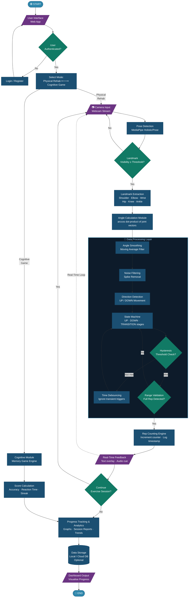

```mermaid
flowchart TD
    START([🟢 START]):::oval --> UI
    UI[/User Interface\nWeb App/]:::parallelogram --> AUTH
    AUTH{User\nAuthenticated?}:::diamond
    AUTH -- No --> LOGIN[Login / Register]:::rect --> UI
    AUTH -- Yes --> SEL
    SEL[Select Mode:\nPhysical Rehab ⟵⟶ Cognitive Game]:::rect
    SEL -- Physical\nRehab --> CAM
    CAM[/📷 Camera Input\nWebcam Stream/]:::parallelogram --> POSE
    POSE[Pose Detection\nMediaPipe Holistic/Pose]:::rect --> VIS
    VIS{Landmark\nVisibility ≥ Threshold?}:::diamond
    VIS -- No --> CAM
    VIS -- Yes --> LAND
    LAND[Landmark Extraction\nShoulder · Elbow · Wrist\nHip · Knee · Ankle]:::rect --> ANGLE
    ANGLE[Angle Calculation Module\narccos dot-product of joint vectors]:::rect --> SMOOTH

    subgraph DPL [" 🔧  Data Processing Layer "]
        direction TB
        SMOOTH[Angle Smoothing\nMoving Average Filter]:::rect --> NOISE
        NOISE[Noise Filtering\nSpike Removal]:::rect --> DIR
        DIR[Direction Detection\nUP / DOWN Movement]:::rect --> SM
        SM[State Machine\nUP · DOWN · TRANSITION stages]:::rect --> HYS
        HYS{Hysteresis\nThreshold Check?}:::diamond
        HYS -- Not met --> DEBOUNCE
        HYS -- Met --> RANGE
        DEBOUNCE[Time Debouncing\nIgnore transient triggers]:::rect --> SM
        RANGE{Range Validation\nFull Rep Detected?}:::diamond
    end

    RANGE -- No --> SM
    RANGE -- Yes --> REP
    REP[Rep Counting Engine\nIncrement counter · Log timestamp]:::rect --> FB
    FB[/Real-Time Feedback\nText overlay · Audio cue/]:::parallelogram --> CONT
    CONT{Continue\nExercise Session?}:::diamond
    CONT -- Yes --> CAM
    CONT -- No --> PROG
    SEL -- Cognitive\nGame --> MEM
    MEM[Cognitive Module\nMemory Game Engine]:::rect --> SCORE
    SCORE[Score Calculation\nAccuracy · Reaction Time · Streak]:::rect --> PROG
    PROG[Progress Tracking & Analytics\nGraphs · Session Reports · Trends]:::rect --> STORE
    STORE[(Data Storage\nLocal / Cloud DB\nOptional)]:::rect --> DASH
    DASH[/Dashboard Output\nVisualise Progress/]:::parallelogram --> END
    END([🔴 END]):::oval
    FB -.->|Real-Time Loop| CAM

    classDef oval          fill:#2E86AB,stroke:#1a5276,color:#fff
    classDef rect          fill:#1B4F72,stroke:#154360,color:#fff
    classDef diamond       fill:#117A65,stroke:#0E6655,color:#fff
    classDef parallelogram fill:#6C3483,stroke:#5B2C6F,color:#fff
    style DPL fill:#0d1b2a,stroke:#2E86AB,stroke-width:2px,color:#aad4f5
```
