# 🔄 AI Rehabilitation System — System Flowchart

> **Stack**: Next.js · FastAPI · Supabase · Gemini API · MediaPipe.js  
> Suitable for hackathon presentation slides and visualization tools.

---

## Full System Flowchart (Mermaid)

```mermaid
flowchart TD
    %% ─────────────────────────────────────────────
    %% ENTRY
    %% ─────────────────────────────────────────────
    START([🟢 Start])
    START --> UI

    %% ─────────────────────────────────────────────
    %% USER INTERFACE
    %% ─────────────────────────────────────────────
    subgraph UILayer["🖥️ User Interface — Web App (Next.js)"]
        UI[/User Opens Web App/]
        UI --> CHOOSE{Choose Mode}
    end

    %% ─────────────────────────────────────────────
    %% BRANCH: PHYSICAL vs COGNITIVE
    %% ─────────────────────────────────────────────
    CHOOSE -->|Physical Rehab| CAM
    CHOOSE -->|Cognitive Training| COG_START

    %% ─────────────────────────────────────────────
    %% PHYSICAL REHABILITATION PIPELINE
    %% ─────────────────────────────────────────────
    subgraph PhysicalPipeline["🏋️ Physical Rehabilitation Pipeline (Browser / Client-Side)"]
        direction TB

        CAM[/📷 Camera Input — Webcam/]
        CAM --> MP[MediaPipe Pose Detection]
        MP --> LM[Landmark Extraction\nShoulder · Elbow · Hip · Knee · Ankle]
        LM --> VIS{Visibility Check\nConfidence ≥ Threshold?}

        VIS -->|No — low confidence| CAM
        VIS -->|Yes| ANGLE[Angle Calculation Module\ncos⁻¹ dot-product of 3 joints]

        subgraph DataProc["⚙️ Data Processing Layer"]
            direction TB
            SMOOTH[Angle Smoothing\nMoving Average Filter]
            NOISE[Noise Filtering\nSpike Removal]
            DIR[Direction Detection\nUP / DOWN Movement]
            SM[State Machine\nStage: UP or DOWN]
            HYST[Hysteresis Threshold Logic\nPrevents false triggers]
            DEBOUNCE[Time Debouncing\nMin interval between reps]
            RANGE[Range Validation\nFull rep — min/max angle met?]
        end

        ANGLE --> SMOOTH --> NOISE --> DIR --> SM --> HYST --> DEBOUNCE --> RANGE

        RANGE --> VALID{Valid Rep?}
        VALID -->|No| DIR
        VALID -->|Yes| REP[Rep Counting Engine\nIncrement + log timestamp]
    end

    %% ─────────────────────────────────────────────
    %% COGNITIVE MODULE
    %% ─────────────────────────────────────────────
    subgraph CogPipeline["🧠 Cognitive Module (Browser / Client-Side)"]
        direction TB
        COG_START[/User Starts Memory Game/]
        COG_PLAY[Display Memory Cards\nSequence / Pattern Challenge]
        COG_INPUT[/User Input — Card Selection/]
        COG_CHECK{Answer Correct?}
        COG_SCORE[Score Calculation\nAccuracy · Speed · Streak]

        COG_START --> COG_PLAY --> COG_INPUT --> COG_CHECK
        COG_CHECK -->|Wrong| COG_PLAY
        COG_CHECK -->|Correct| COG_SCORE
    end

    %% ─────────────────────────────────────────────
    %% REAL-TIME FEEDBACK SYSTEM (loopback)
    %% ─────────────────────────────────────────────
    subgraph FeedbackLoop["🔁 Real-Time Feedback System"]
        direction LR
        FB_TEXT[Text Feedback\ne.g. 'Go lower — full range needed']
        FB_AUDIO[Audio Cue\nBeep / Voice prompt]
        FB_OVERLAY[Skeleton Overlay\nCanvas joint rendering]
    end

    REP --> FB_TEXT
    REP --> FB_AUDIO
    MP  --> FB_OVERLAY

    FB_TEXT  --> LOOP{Continue\nSession?}
    FB_AUDIO --> LOOP
    LOOP -->|Yes — next rep| CAM
    LOOP -->|No — session end| SUMMARY

    %% ─────────────────────────────────────────────
    %% SESSION SUMMARY & STORAGE
    %% ─────────────────────────────────────────────
    COG_SCORE --> SUMMARY
    SUMMARY[/Session Summary\nRep count · Angle stats · Form score · Duration/]

    subgraph BackendLayer["⚙️ Backend — FastAPI"]
        direction TB
        API[REST API Layer\nPOST /sessions · POST /game-sessions]
        SVC[Service Layer\nBusiness logic · Validation]
        GEM[Gemini API Client\nPersonalised feedback prompt]
    end

    SUMMARY --> API --> SVC --> GEM

    subgraph Storage["🗄️ Data Storage — Supabase (PostgreSQL)"]
        DB[(users\nsessions\nexercise_logs\ngame_sessions\nai_feedback)]
    end

    SVC -->|Read / Write| DB

    GEM -->|"Prompt + historical context"| GEMINI_EXT["🌐 Google Gemini API"]
    GEMINI_EXT -->|"AI feedback text"| GEM

    %% ─────────────────────────────────────────────
    %% PROGRESS TRACKING & ANALYTICS
    %% ─────────────────────────────────────────────
    subgraph Analytics["📊 Progress Tracking & Analytics"]
        direction TB
        CHARTS[Recovery Charts\nRange of motion · Reps over time]
        REPORTS[Session Reports\nForm quality · Trend analysis]
        AI_CARD[AI Insight Card\nGemini-generated recommendations]
    end

    DB      --> CHARTS
    DB      --> REPORTS
    GEM     --> AI_CARD

    CHARTS  --> DASHBOARD
    REPORTS --> DASHBOARD
    AI_CARD --> DASHBOARD

    DASHBOARD[/📱 User Dashboard\nView progress · Insights · History/]
    DASHBOARD --> END([🔴 End / Next Session])

    %% ─────────────────────────────────────────────
    %% STYLING
    %% ─────────────────────────────────────────────
    classDef startEnd   fill:#4ade80,stroke:#16a34a,color:#000,rx:20
    classDef process    fill:#3b82f6,stroke:#1d4ed8,color:#fff
    classDef decision   fill:#f59e0b,stroke:#b45309,color:#000
    classDef io         fill:#a78bfa,stroke:#7c3aed,color:#fff
    classDef storage    fill:#f97316,stroke:#c2410c,color:#fff
    classDef external   fill:#e5e7eb,stroke:#6b7280,color:#000

    class START,END startEnd
    class MP,LM,ANGLE,SMOOTH,NOISE,DIR,SM,HYST,DEBOUNCE,RANGE,REP,COG_PLAY,COG_SCORE,API,SVC,GEM,FB_TEXT,FB_AUDIO,FB_OVERLAY,CHARTS,REPORTS,AI_CARD process
    class CHOOSE,VIS,VALID,COG_CHECK,LOOP decision
    class UI,CAM,COG_START,COG_INPUT,SUMMARY,DASHBOARD io
    class DB storage
    class GEMINI_EXT external
```



---

## Component Legend

| Symbol | Shape | Meaning |
|--------|-------|---------|
| 🟢 Oval | `([...])` | Start / End |
| 🔵 Rectangle | `[...]` | Process / Computation |
| 🟡 Diamond | `{...}` | Decision / Threshold Check |
| 🟣 Parallelogram | `[/..../]` | Input / Output |
| 🟠 Cylinder | `[(....)]` | Data Storage |

---

## Module Summary

| Module | Location | Description |
|--------|----------|-------------|
| **User Interface** | Browser (Next.js) | Web app entry point, mode selection |
| **Camera Input** | Browser | Webcam stream via `getUserMedia` |
| **Pose Detection** | Browser (MediaPipe.js) | Skeleton tracking at ~30–60 fps, fully client-side |
| **Landmark Extraction** | Browser | 33 body keypoints (shoulder, elbow, hip, knee, ankle) |
| **Angle Calculation** | Browser | Dot-product / arccos formula on 3 joint vectors |
| **Angle Smoothing** | Browser | Moving average over last N frames to reduce jitter |
| **Noise Filtering** | Browser | Spike removal — discard outlier angles |
| **Visibility Check** | Browser | Threshold on MediaPipe confidence score |
| **Direction Detection** | Browser | Track ascending vs. descending angle trend |
| **State Machine** | Browser | UP/DOWN stage tracking for rep detection |
| **Hysteresis Logic** | Browser | Upper/lower thresholds prevent double-counting |
| **Time Debouncing** | Browser | Minimum ms between valid rep registrations |
| **Range Validation** | Browser | Confirm full range-of-motion for each rep |
| **Rep Counting Engine** | Browser | Increment counter, log timestamp + angle stats |
| **Cognitive Module** | Browser | Memory card game, score + accuracy calculation |
| **Real-Time Feedback** | Browser | On-screen text + audio cues at each rep |
| **Session Summary** | Browser → API | POST aggregated metrics to FastAPI |
| **FastAPI Backend** | Server | Stores sessions, orchestrates Gemini calls |
| **Gemini API** | External | Generates personalised AI recovery feedback |
| **Supabase DB** | Cloud | Persists users, sessions, logs, AI feedback |
| **Progress Dashboard** | Browser | Charts, trends, AI insight cards |

---

## Real-Time Loop Highlight

The inner feedback loop (highlighted below) runs **continuously at frame rate** inside the browser — no server round-trips required:

```
Camera Frame → MediaPipe → Landmarks → Angle Calc → Data Processing → Rep Counter → Feedback → (next frame)
```

> All pose tracking, angle math, and rep counting happen **100% client-side**, ensuring sub-frame latency and full data privacy (no video is ever uploaded).
